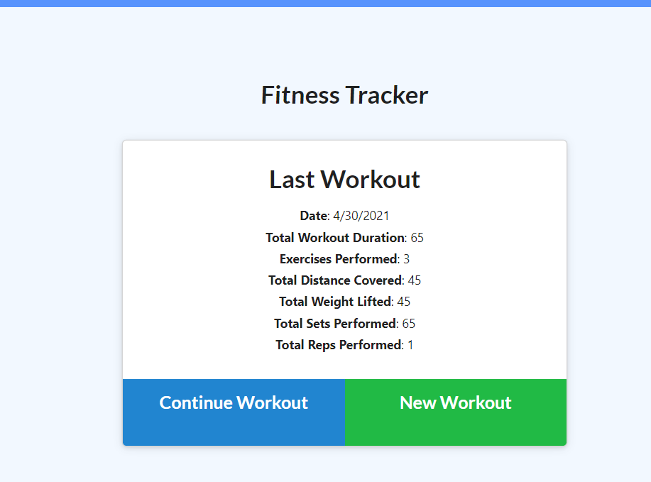

# Fitness-Tracker

## Description 
The Fitness-Tracker application allows users to Create workouts, track and store workout data, and ability to view in graphical format. Deployed on Heroku,using the Express,Mongo, Robot 3T, Mongoose packages. 
 
## Table of Contents
* [Installation](#installation)
* [Usage](#usage)
* [Contributing](#contributing)
* [Questions](#questions)

 Link to deployed app on [Heroku](https://aqueous-inlet-51778.herokuapp.com/)

## Installation 
The user should install and  Mongo db, Atlas, Robot 3t, Mongoose, Express packages. 

## Usage 
Prompts for user input in fields, to create or continue workout.

## Contributing 
Users should refer to the Installation Section. 

## Questions
 Any questions ? Email me at kelsie51@hotmail.com, Github URL for project at https://github.com/kelsie51/Fitness-Tracker

